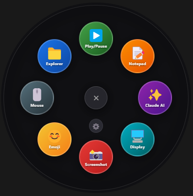

<div align="center">

# 🖱️ Mouse Radial Menu

**A beautiful radial shortcut menu for Windows — triggered by holding your middle mouse button**



[](https://github.com)
[](https://electronjs.org)
[](https://nodejs.org)
[](LICENSE)

</div>

---

## ✨ Features

- 🖱️ **Hold middle mouse button** for ~150ms to open the menu at your cursor
- 🌈 **Colorful animated icons** with smooth spring open/close animation
- ⚙️ **Full settings UI** — add, edit, delete and reorder shortcuts visually
- 💾 **Persistent config** — your shortcuts are saved between sessions
- 🎯 **8 radial positions** — place shortcuts at any clock position
- 🔔 **System tray** — runs silently in background, shows balloon on start
- ⌨️ **Keyboard shortcut** — `Ctrl+Space` as fallback trigger
- 🚀 **Portable exe** — single file, no install needed

---

## 📸 Preview

<div align="center">


*Hold middle mouse → menu opens instantly at your cursor*

</div>

---

## 🚀 Quick Start

### Option A — Download portable exe (no setup)
1. Download `RadialMenu-Portable.exe` from [Releases](../../releases)
2. Double-click → allow UAC prompt (needed for mouse hook)
3. App starts in system tray — hold middle mouse button anywhere!

### Option B — Run from source
```bash
# Clone the repo
git clone https://github.com/yourusername/mouse-radial-menu.git
cd mouse-radial-menu

# Install dependencies
npm install

# Run
npm start
```

---

## 🎮 How to Use

| Action | Result |
|--------|--------|
| **Hold Middle Mouse** (~150ms) | Opens radial menu at cursor |
| **Hover** an icon | Shows label tooltip |
| **Click** an icon | Launches the app / action |
| **Click ✕ center** | Closes menu |
| **Escape key** | Closes menu |
| **Ctrl + Space** | Toggle menu (keyboard fallback) |
| **Tray icon double-click** | Opens Shortcuts settings |
| **Tray icon right-click** | Manage shortcuts / Quit |

---

## 🎨 Default Shortcuts

| Icon | Name | Action |
|------|------|--------|
| 📁 | Explorer | Opens File Explorer |
| ▶️ | Play/Pause | Media play/pause key |
| 📝 | Notepad | Opens Notepad |
| ✨ | Claude AI | Opens claude.ai in browser |
| 🖥️ | Display | Windows Display Settings |
| 📸 | Screenshot | Win+Shift+S snipping tool |
| 😊 | Emoji | Windows Emoji Picker (Win+.) |
| 🖱️ | Mouse | Mouse Settings (Control Panel) |

---

## ⚙️ Adding Custom Shortcuts

Click the **⚙️ gear button** in the radial menu center, or **double-click the tray icon**.

<div align="center">


</div>

### Shortcut Types

| Type | Example Value | Description |
|------|--------------|-------------|
| **App / EXE** | `notepad.exe` or `C:\path\app.exe` | Launch any application |
| **Website URL** | `https://github.com` | Open in default browser |
| **Open Folder** | `C:\Users\You\Documents` | Open folder in Explorer |
| **Key Shortcut** | `win+shift+s` or `ctrl+c` | Send keyboard shortcut |
| **Windows Settings** | `ms-settings:display` | Open Settings page |
| **Media Control** | *(no value needed)* | Play/Pause media |

### Supported Key Names for Shortcuts
```
win, ctrl, alt, shift
a-z, 0-9, f1-f12
space, enter, esc, tab, del
. , / ; ' \ ` - =
```

---

## 🏗️ Build from Source

```bash
# Install dependencies
npm install

# Run in development
npm start

# Build portable .exe
npm run build

# Build installer (.exe with wizard)
npm run build-installer
```

Output appears in `dist/` folder:
```
dist/
├── RadialMenu-Portable.exe       ← Single portable file
└── RadialMenu Setup 1.0.0.exe    ← Installer with Start Menu entry
```

---

## 📁 Project Structure

```
mouse-radial-menu/
├── main.js          ← Electron main process, mouse hook, IPC, system actions
├── index.html       ← Radial menu UI (HTML/CSS/JS with animations)
├── settings.html    ← Shortcut manager UI
├── preload.js       ← IPC bridge
├── package.json     ← Config + build settings
└── icon.ico         ← App icon
```

---

## 🔧 Troubleshooting

**Menu doesn't appear on middle click?**
- Run as Administrator (right-click exe → "Run as administrator")
- Check PowerShell execution policy:
  ```powershell
  Set-ExecutionPolicy RemoteSigned -Scope CurrentUser
  ```
- Use `Ctrl+Space` as fallback to test if app is running

**App won't start / UAC prompt doesn't appear?**
- Make sure you're on Windows 10 or 11
- Try right-clicking the exe → Properties → Compatibility → "Run as administrator"

**Actions don't work after clicking?**
- Some actions (emoji picker, media keys) need the previous window to regain focus — the built-in delay handles most cases
- For emoji picker, make sure a text field was focused before opening the menu

---

## 🛠️ Tech Stack

- **[Electron](https://electronjs.org)** — Cross-platform desktop framework
- **PowerShell** — Global mouse hook via `GetAsyncKeyState` Win32 API
- **HTML/CSS/JS** — Radial menu UI with CSS animations
- **[electron-builder](https://electron.build)** — Packaging and distribution

---

## 📄 License

MIT © 2026 — Free to use, modify and distribute.

---

<div align="center">

**If you find this useful, give it a ⭐ on GitHub!**

Made with ❤️ using Electron

</div>
